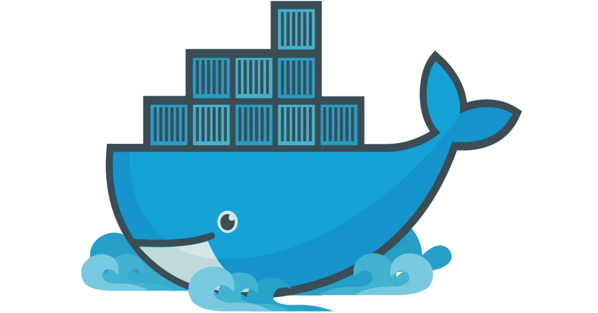

# What Are Containers?

## Overview

**Containers** are lightweight, isolated runtime environments that package an application **together with its dependencies, libraries, and configuration**, allowing it to run consistently across different systems.

---

## Why Containers Exist

Traditional application deployment depended heavily on the host system’s configuration.  

Differences in operating systems, library versions, and environment variables often caused applications to behave **inconsistently**.

**Containers solve this by:**
- isolating applications from the host environment
- bundling everything the application needs to run
- providing reproducibility across machines

This directly addresses environment-related deployment failures.

---

## What a Container Contains

A container typically includes:
- application code
- runtime (e.g., JVM, Node.js, Python)
- required libraries and dependencies
- environment variables and configuration
- process isolation rules

All of this is packaged into a single runnable unit.

---

## How Containers Work

Containers use **operating system–level virtualization**.

- multiple containers run on the same host
- they **share the host OS kernel**
- isolation is enforced using kernel features such as namespaces and cgroups

This makes containers lightweight compared to virtual machines.

---

## Container Lifecycle

1. Image is built
2. Container is created from image
3. Container runs application process
4. Container is stopped or destroyed when no longer needed

Containers are designed to be **ephemeral**, not long-lived pets.

---

## Real-World Example

A backend system might run:
- one container for API service
- one container for database
- one container for cache (Redis)

All running independently on the same host.

---

## Summary

- Containers are isolated runtime environments for applications

- They bundle code, dependencies, and configuration

- Containers share the host OS kernel

- They are lightweight, fast, and scalable

- Containers are foundational for modern backend architectures

---
