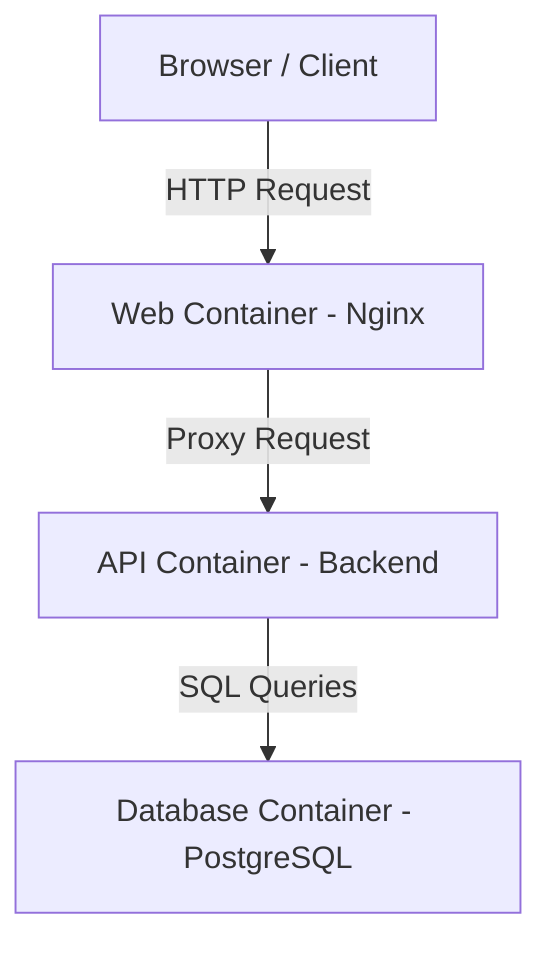
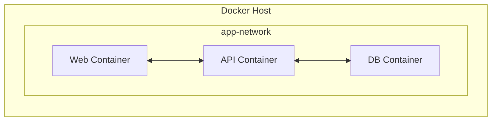
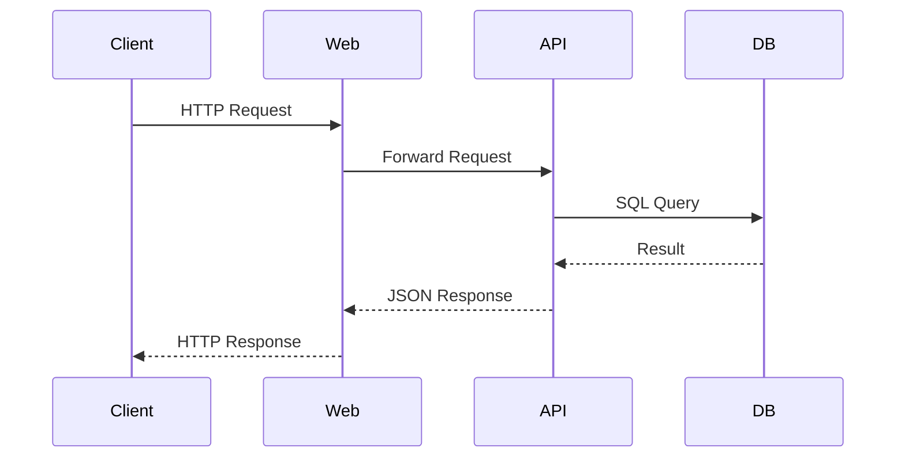

# From Dockerfile to a 3-Tier Application

## Overview

This section consolidates everything into a **single, end-to-end Docker workflow**.  
You will see how Docker is used in real backend systems to:

- Containerize applications

- Build reusable images

- Create isolated networks

- Persist data using volumes

- Run a **3-tier web application** (Web → API → Database)

- Configure environment-based runtime behavior

- Ensure production-ready container practices

This mirrors how Docker is used in production-grade backend architectures.

---

## What Is a 3-Tier Architecture?

A **3-tier application** separates responsibilities into distinct layers:

1. **Web Tier** – Handles HTTP requests (Frontend / Reverse Proxy)

2. **Application Tier** – Business logic (Backend API)

3. **Data Tier** – Persistent storage (Database)

Each tier runs in its **own container**, ensuring isolation, scalability, and maintainability.

---

## High-Level Docker Architecture for This Setup



All containers communicate over a **custom Docker bridge network**, and the database uses a **named volume** for persistence.

---

## Network-Level View



- Docker provides **built-in DNS resolution**
- Containers can reach each other via **service name**
- External traffic enters only through exposed ports

---

## Step 1 — Project Structure

```
project-root/
│
├── web/
│   ├── Dockerfile
│   └── nginx.conf
│
├── api/
│   ├── Dockerfile
│   ├── package.json
│   └── src/
│
└── db/
```

Each tier is isolated and independently buildable.

---

## Step 2 — Writing Dockerfiles

### Web Tier (Nginx)

**`web/Dockerfile`**

```dockerfile
FROM nginx:alpine

COPY nginx.conf /etc/nginx/nginx.conf

EXPOSE 80

CMD ["nginx", "-g", "daemon off;"]
```

Purpose:

- Serves as entry point
- Proxies requests to API container
- Runs in foreground (required for container lifecycle)

---

### Application Tier (Backend API – Example: Node.js)

**`api/Dockerfile`**

```dockerfile
FROM node:18-alpine

WORKDIR /app

COPY package.json package-lock.json* ./
RUN npm install --production

COPY . .

ENV PORT=3000
EXPOSE 3000

CMD ["npm", "start"]
```

**Key Best Practices Added**:

- Using lightweight `alpine` image
- Installing only production dependencies
- Copying dependency files first (layer caching optimization)

Purpose:

- Hosts business logic
- Connects to database using environment variables
- Exposes internal API port (not necessarily published)

---

### Database Tier

Databases typically use **official images** directly.

Example image:

```
postgres:15
```

Why not build custom?

- Official images are production-hardened
- Already configured for volume-based persistence
- Follow best practices internally

---

## Step 3 — Building Docker Images

From project root:

```bash
docker build -t web-tier:1.0 ./web
docker build -t api-tier:1.0 ./api
```

At this point:

- Images are immutable
- Layers are cached
- No containers are running yet

Verify:

```bash
docker images
```

---

## Step 4 — Creating a Custom Docker Network

```bash
docker network create app-network
```

Why this matters:

- Enables container-to-container communication
- Provides automatic DNS resolution
- Isolates the application stack from other containers
- Uses the bridge driver by default

Inspect:

```bash
docker network inspect app-network
```

---

## Step 5 — Creating a Named Volume for Persistence

```bash
docker volume create db-data
```

This ensures database data survives:

- Container restarts
- Container deletions
- Image rebuilds

Inspect:

```bash
docker volume inspect db-data
```

---

## Step 6 — Running the Database Container

```bash
docker run -d \
  --name db \
  --network app-network \
  -v db-data:/var/lib/postgresql/data \
  -e POSTGRES_USER=admin \
  -e POSTGRES_PASSWORD=secret \
  -e POSTGRES_DB=appdb \
  --restart=unless-stopped \
  postgres:15 
```

Key points:

- Attached to custom network
- Uses named volume
- Configured via environment variables
- Restart policy added for resilience

---

## Step 7 — Running the API Container

```bash
docker run -d \
  --name api \
  --network app-network \
  -e DB_HOST=db \
  -e DB_PORT=5432 \
  -e DB_USER=admin \
  -e DB_PASSWORD=secret \
  -e DB_NAME=appdb \
  --restart=unless-stopped \
  api-tier:1.0
```

Important:

- `DB_HOST=db` works because of Docker DNS
- No need to expose port externally
- Communicates internally within network

Optional (if external debugging needed):

```bash
-p 3000:3000
```

---

## Step 8 — Running the Web Container

```bash
docker run -d \
  --name web \
  --network app-network \
  -p 8080:80 \
  --restart=unless-stopped \
  web-tier:1.0
```

Now:

- Application is accessible at `http://localhost:8080`
- Traffic flows through all three tiers
- Only web tier is publicly exposed

---

## Full Runtime Flow



---

## Step 9 — Verifying the Setup

Check running containers:

```bash
docker ps
```

Check logs:

```bash
docker logs web
docker logs api
docker logs db
```

Test connectivity:

```bash
docker exec -it api sh
```

Inside container:

```bash
ping db
```

Restart database container and confirm data persists.

---

## Common Mistakes to Avoid

- Using `localhost` between containers

- Not using a custom network

- Storing database data inside containers

- Hardcoding configuration values

- Relying on `latest` tags

- Running containers as root in production

- Exposing database ports publicly

---

## Interview Questions

### 1. Why use a custom Docker network?

**Answer:**
It enables reliable container-to-container communication using service names with built-in DNS.

---

### 2. Why is a named volume required for databases?

**Answer:**
To persist data independently of container lifecycle.

---

### 3. How does the API container connect to the database?

**Answer:**
Using the database container name as the hostname over a Docker bridge network.

---

### 4. Why are separate Dockerfiles used for each tier?

**Answer:**
To isolate responsibilities and allow independent builds and deployments.

---

### 5. What happens if the database container is deleted?

**Answer:**
The data remains safe in the named Docker volume unless explicitly removed.

---

## Summary

- Dockerfiles define reproducible environments

- Images are built once and reused

- Containers run inside an isolated network

- Volumes provide persistent storage

- Only the web tier is exposed externally

- Environment variables control runtime configuration

- Restart policies improve resilience

- A 3-tier architecture maps naturally to Docker containers

---

