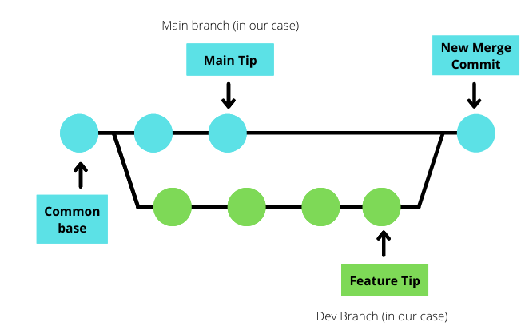

# Introduction to Merging in Git

## Overview

**Merging** in Git is the process of **combining the history of two branches into one unified branch**.  
It is commonly used to bring changes from a feature or bug-fix branch back into a main integration branch such as `main` or `develop`.

Merging preserves the commit history of both branches and creates a new commit that represents the point where their histories joined.

---

## Why Merging Is Needed

In real-world backend projects, work does not happen on a single branch. Teams:

- build new features
- fix production bugs
- refactor modules
- experiment safely

All of this happens in **separate branches**.

Merging enables:

- integration of completed features into the main codebase
- collaboration across multiple developers
- gradual and safe development without breaking stable code

---

## What Git Merge Actually Does

When you merge:

1. Git finds the **common ancestor commit** of the two branches
2. Git compares changes made on each branch since that ancestor
3. Git combines those changes into the target branch
4. Git may create a **merge commit** to represent the integration

No branch’s history is rewritten; history is **preserved as-is**.

---

## Basic Merge Command

To merge a branch into the current branch:

```bash
git merge feature-auth
```

Meaning:

* You are currently on the branch that will receive the changes (e.g., `main`)
* Git brings in commits from `feature-auth`

Typical workflow:

```bash
git checkout main
git merge feature-auth
```



---

## Types of Merges

### 1. Fast-Forward Merge

Occurs when the target branch has **no new commits** since branching.

Git simply “moves the pointer forward.”

```
main ---- A ---- B
              \
               C ---- D (feature)

Fast-forward moves main to D
```

No merge commit is created.

---

### 2. Three-Way Merge

Occurs when both branches have diverged.

Git uses:

* branch tip 1
* branch tip 2
* their common ancestor

It then creates a **merge commit**.

```
      C ---- D (feature)
     /
A ---- B
     \
      E ---- F (main)

Merge commit joins both lines of history
```

---

## Merge Conflicts (High-Level Idea)

Conflicts occur when:

* two branches modify the **same lines**
* one deletes code the other modifies
* incompatible structural changes occur

Git stops and asks the developer to resolve the conflict manually before completing the merge.

Conflicts are **normal and expected** in collaborative development.

(Detailed conflict resolution can be covered later.)

---

## When to Use Merging

Merging is appropriate when:

* you want to **preserve complete history**
* team workflows use pull requests
* auditability matters
* rewriting history is undesirable

This aligns with most enterprise backend practices.

---

## Merging vs Rebase (High-Level Distinction)

* **Merge** preserves full branch history
* **Rebase** rewrites commit history for linearity

Merging is usually preferred in:

* shared team branches
* protected branches like `main`

Rebase requires deeper understanding and caution.

---

## Interview Questions

1. **What is merging in Git and why is it used?**
   Explain branch integration and history preservation.

2. **What is the difference between fast-forward and three-way merge?**
   Describe how history diverges.

3. **What is a merge commit?**
   Explain its role in the commit graph.

4. **When do merge conflicts occur?**
   Discuss overlapping or incompatible changes.

5. **How is merging different from rebasing at a high level?**
   Focus on history preservation vs rewriting.

---

## Summary

* Merging combines the history of two branches

* It is fundamental for multi-branch development workflows

* Fast-forward merges simply move branch pointers

* Three-way merges create merge commits

* Merge conflicts are normal and must be resolved manually

* Merging preserves history, making it preferred in many backend teams

---