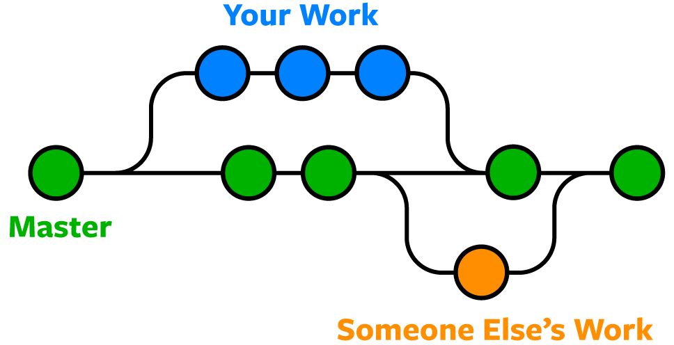

# Introduction to Branches in Git

## Overview

In Git, a **branch** represents an independent line of development within a repository.  

Branches allow developers to work on new features, bug fixes, or experiments without affecting the stability of the main codebase.



---

## Why Branches Exist

Modern software development rarely happens in a single straight line.  
Multiple features, fixes, and improvements are often developed simultaneously.

Branches solve this by allowing:
- Parallel development by multiple developers
- Isolation of unstable or experimental code
- Protection of stable production-ready code

Without branches, teams would be forced to commit all changes directly to the main codebase, increasing the risk of breaking production systems.

---

## What a Branch Represents Internally

A branch in Git is **a movable pointer to a commit**.  
It does not copy the entire codebase. Instead, it points to a specific commit in the repository history.

As new commits are added on a branch, the pointer moves forward, forming a distinct line of history.

This design makes branching extremely efficient.

---

## Default Branch (`main`)

When a repository is initialized, Git creates a default branch, commonly named `main`.

The `main` branch typically represents:
- Stable, production-ready code
- A reliable baseline for new development
- The source for releases and deployments

Direct commits to `main` are often restricted in professional teams.

---

## Creating and Switching Branches

### 1. Create a New Branch

```bash
git branch feature-auth
```

This creates a new branch based on the current commit but does not switch to it.

---

### 2. Switch to a Branch

```bash
git checkout feature-auth
```

Moves the working directory to the specified branch.

---

### 3. Create and Switch in One Command

```bash
git checkout -b feature-auth
```

Creates the branch and switches to it immediately.

---

## Viewing Branches

### 1. List All Local Branches

```bash
git branch
```

The currently active branch is marked with an asterisk (`*`).

---

### 2. List All Branches (Local + Remote)

```bash
git branch -a
```

Useful when working with remote repositories.

---

## Typical Backend Branch Workflow

1. Start from `main`
2. Create a feature branch
3. Develop and commit changes
4. Merge the branch after review and testing
5. Delete the branch once complete

This workflow ensures code stability and clean history.

---

## Interview Questions

1. **What is a Git branch, and how is it represented internally?**
   Explain the concept of pointers to commits.

2. **Why are branches considered lightweight in Git?**
   Discuss how Git avoids copying the entire codebase.

3. **Why should direct commits to `main` be avoided in teams?**
   Focus on stability and review processes.

4. **What is the difference between `git branch` and `git checkout`?**
   Explain creation vs switching.

5. **How do branches improve backend development workflows?**
   Relate to parallel development and safe releases.

---

## Summary

* A Git branch is an independent line of development

* Branches point to commits rather than copying code

* The `main` branch represents stable code

* Feature branches enable safe and parallel work

* Branching is essential for professional backend engineering

---