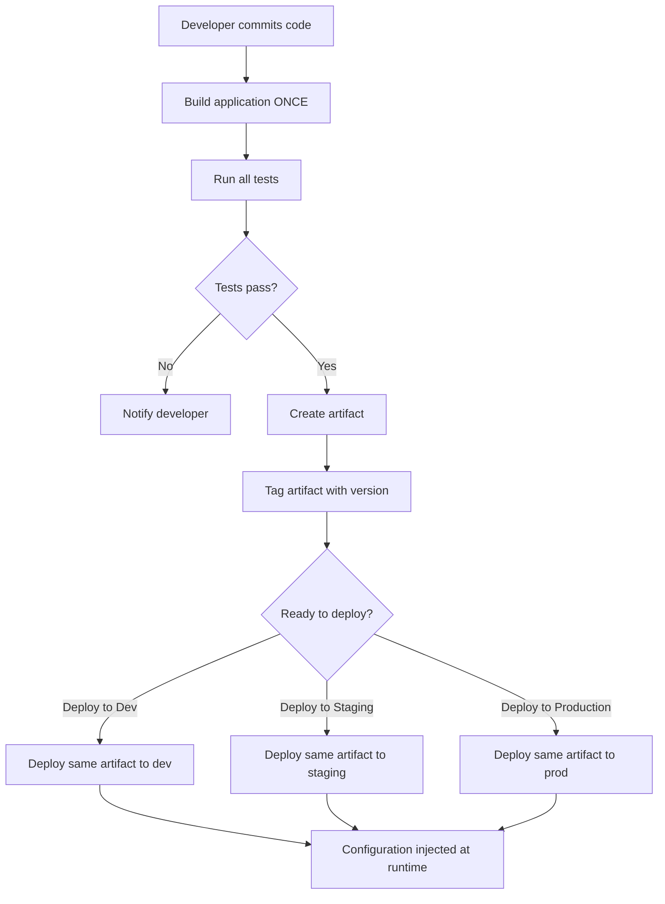

# Build Once, Deploy Everywhere

## Overview

**Build Once, Deploy Everywhere (BODE)** is a principle that dictates building an application artifact **once** and deploying that **same exact artifact** to multiple environments (dev, staging, production).

Instead of rebuilding the application for each environment, the same binary/container is promoted through the pipeline.

This ensures:

* consistency across environments
* no environment-specific code changes
* faster deployments
* reduced risk of environment-specific bugs

---

## The Problem It Solves

Traditional approaches rebuilt applications for each environment:

```
Source Code → Build for Dev → Build for Staging → Build for Production
```

This caused:

* environment-specific bugs (works in dev, fails in prod)
* slower deployments (rebuilding takes time)
* configuration drift between environments
*难以追踪哪个版本运行在哪里
* increased risk of human error during builds

BODE solves this by treating environments as deployment targets, not build targets.

---

## How It Works

### Build Once, Deploy Everywhere Workflow



---

## Core Concepts

### 1. Artifact

A **single, immutable artifact** (JAR, Docker image, WAR, etc.) built once and promoted.

Example:
```
app-1.2.3.jar → deployed to all environments
myapp:1.2.3 → same Docker image to all environments
```

### 2. Immutability

The artifact **never changes** after it's built. Configuration changes apply at **runtime**, not build time.

### 3. Environment Configuration

Configuration is **injected at deployment time**, not embedded in the artifact.

| Approach | Why BODE | Why Not |
| --- | --- | --- |
| **Config in JAR** | ✗ Requires rebuild | Different binary per env |
| **External config files** | ✓ Same artifact everywhere | Configuration managed separately |
| **Environment variables** | ✓ Runtime injection | Clean separation of concerns |
| **ConfigMaps (K8s)** | ✓ Immutable pod specs | Modern, scalable approach |

---

## Jenkins Implementation Example

### Jenkinsfile: Build Once, Deploy Everywhere

```groovy
pipeline {
    agent any

    environment {
        ARTIFACT_VERSION = "${BUILD_NUMBER}"
    }

    stages {
        stage('Build') {
            steps {
                sh 'npm install'
                sh 'npm run build'
                sh 'tar -czf app-${ARTIFACT_VERSION}.tar.gz dist/'
            }
        }

        stage('Test') {
            steps {
                sh 'npm run test:unit'
                sh 'npm run test:integration'
            }
        }

        stage('Store Artifact') {
            steps {
                sh 'docker build -t myapp:${ARTIFACT_VERSION} .'
                sh 'docker tag myapp:${ARTIFACT_VERSION} myregistry.azurecr.io/myapp:${ARTIFACT_VERSION}'
                sh 'docker push myregistry.azurecr.io/myapp:${ARTIFACT_VERSION}'
            }
        }

        stage('Deploy to Dev') {
            steps {
                sh './deploy.sh dev myregistry.azurecr.io/myapp:${ARTIFACT_VERSION}'
            }
        }

        stage('Deploy to Staging') {
            input {
                message 'Deploy to staging?'
            }
            steps {
                sh './deploy.sh staging myregistry.azurecr.io/myapp:${ARTIFACT_VERSION}'
            }
        }

        stage('Deploy to Production') {
            input {
                message 'Deploy to production?'
            }
            steps {
                sh './deploy.sh production myregistry.azurecr.io/myapp:${ARTIFACT_VERSION}'
            }
        }
    }
}
```

Same artifact (`myapp:${ARTIFACT_VERSION}`) deployed everywhere.

---

## Configuration Management

### Using Environment Variables

```bash
#!/bin/bash
ENVIRONMENT=$1
ARTIFACT=$2

# External configuration per environment
if [ "$ENVIRONMENT" = "production" ]; then
    DB_HOST=prod-db.example.com
    LOG_LEVEL=error
elif [ "$ENVIRONMENT" = "staging" ]; then
    DB_HOST=staging-db.example.com
    LOG_LEVEL=warn
else
    DB_HOST=dev-db.example.com
    LOG_LEVEL=debug
fi

# Deploy same artifact with different config
docker run \
    -e DB_HOST=$DB_HOST \
    -e LOG_LEVEL=$LOG_LEVEL \
    $ARTIFACT
```

### Using Kubernetes ConfigMaps

```yaml
# dev-config.yaml
apiVersion: v1
kind: ConfigMap
metadata:
  name: app-config
data:
  database: dev-db.example.com
  log_level: debug
---
# prod-config.yaml
apiVersion: v1
kind: ConfigMap
metadata:
  name: app-config
data:
  database: prod-db.example.com
  log_level: error
---
# deployment.yaml (SAME for all environments)
apiVersion: apps/v1
kind: Deployment
metadata:
  name: myapp
spec:
  containers:
  - name: app
    image: myapp:1.2.3  # SAME image everywhere
    envFrom:
    - configMapRef:
        name: app-config  # Different config per environment
```

---

## Benefits

| Benefit | Impact |
| --- | --- |
| **Consistency** | Same code runs in all environments |
| **Reliability** | Environment-specific bugs eliminated |
| **Speed** | No rebuilding—just redeploy the same artifact |
| **Traceability** | Know exactly which version is where |
| **Rollback safety** | Quickly redeploy previous artifact version |
| **Cost efficiency** | Build once, save CI/CD resources |

---

## Best Practices

### 1. Use Semantic Versioning

```
app:1.0.0
app:1.0.1 (patch)
app:1.1.0 (minor)
app:2.0.0 (major)
```

### 2. Make Artifacts Immutable

Never overwrite a version tag. Use unique identifiers:

```
# Good
myapp:1.2.3
myapp:1.2.3-build-456

# Bad
myapp:latest (can be overwritten)
myapp:stable (ambiguous)
```

### 3. Separate Configuration from Code

Never embed environment-specific values in the artifact.

```groovy
// BAD - Configuration in code
if (environment == 'production') {
    db_host = 'prod-db.com'
}

// GOOD - Configuration injected at runtime
db_host = System.getenv('DB_HOST')
```

### 4. Validate Artifacts Before Promotion

Test the artifact before deploying to higher environments.

```groovy
stage('Smoke Test') {
    steps {
        sh './test-artifact.sh'
    }
}
```

### 5. Use Artifact Registry

Store artifacts centrally (Docker Registry, Nexus, Artifactory).

```groovy
sh 'docker push myregistry.azurecr.io/myapp:${VERSION}'
```

---

## Summary

* Build Once, Deploy Everywhere builds an artifact once and promotes it through environments

* Same artifact deployed to dev, staging, and production

* Configuration is injected at runtime, not embedded in the artifact

* Eliminates environment-specific bugs and configuration drift

* Reduces build time and resource consumption

* Requires immutable artifact versioning and external configuration management

---
