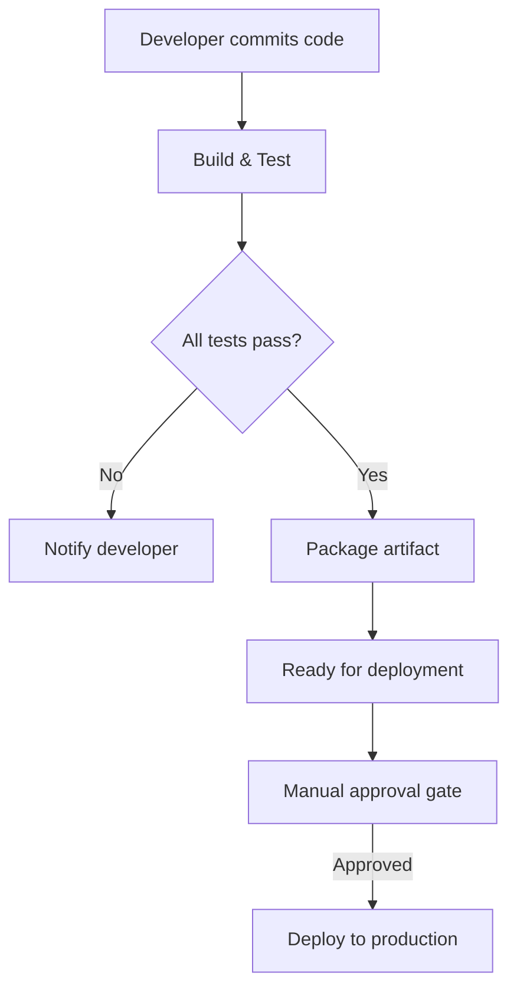
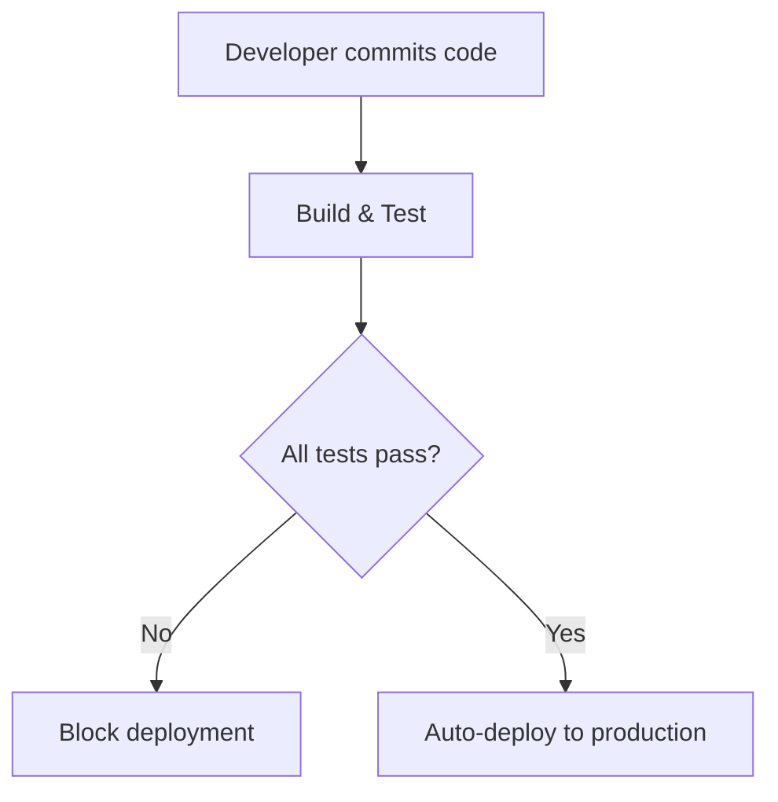

# Continuous Delivery vs Continuous Deployment

## Overview

**Continuous Delivery (CD)** and **Continuous Deployment** both automate the path to production, but differ in the final step.

* **Continuous Delivery** — builds are production-ready; deployment requires **manual approval**
* **Continuous Deployment** — builds are **automatically deployed** to production

The choice depends on organizational needs, compliance, and risk tolerance.

---

## The Problem They Solve

Traditional workflows caused:

* long development cycles before releases
* manual, error-prone deployments
* slow feedback to users
* delayed bug fixes and features

Both practices solve this by automating the delivery pipeline, reducing risk and time to market.

---

## How They Work

### Continuous Delivery Workflow



---

### Continuous Deployment Workflow



---

## Key Differences

| Aspect | Continuous Delivery | Continuous Deployment |
| --- | --- | --- |
| **Approval** | Manual (required) | Automatic (none) |
| **Trigger** | Human decision | Code passes tests |
| **Risk** | Lower (human gate) | Higher (automation-dependent) |
| **Deployment frequency** | Variable (hours to days) | Constant (minutes to hours) |
| **Testing requirements** | High | Extremely high (>95% coverage) |
| **Best for** | Enterprise, compliance-heavy | Startups, high-velocity teams |

---

## Continuous Delivery Examples

**Jenkins Pipeline:**

```groovy
pipeline {
    agent any

    stages {
        stage('Build & Test') {
            steps {
                sh 'npm install && npm test'
            }
        }

        stage('Package') {
            steps {
                sh 'npm run build'
            }
        }

        stage('Approval') {
            steps {
                input 'Deploy to production?'
            }
        }

        stage('Deploy') {
            steps {
                sh 'npm run deploy:prod'
            }
        }
    }
}
```

The `input` directive pauses and waits for manual approval.

---

## Continuous Deployment Examples

**Jenkins Pipeline:**

```groovy
pipeline {
    agent any

    stages {
        stage('Build') {
            steps {
                sh 'npm install && npm run build'
            }
        }

        stage('Unit Tests') {
            steps {
                sh 'npm run test:unit'
            }
        }

        stage('Integration Tests') {
            steps {
                sh 'npm run test:integration'
            }
        }

        stage('Security Scan') {
            steps {
                sh 'npm audit'
            }
        }

        stage('Deploy') {
            when {
                branch 'main'
            }
            steps {
                sh 'npm run deploy:prod'
            }
        }
    }
}
```

No approval gate—deployment happens automatically if all tests pass.

---

## When to Use Continuous Delivery

* Regulatory or compliance requirements
* Deployment decisions need stakeholder approval
* Enterprise change control policies
* Control is prioritized over speed

Examples: financial services, healthcare, government systems.

---

## When to Use Continuous Deployment

* Organization prioritizes rapid iteration
* High confidence in test suites
* Quick rollback capabilities exist
* Users expect frequent updates

Examples: SaaS startups, web services, data platforms.

---

## Benefits & Limitations

### Continuous Delivery Benefits

* Human oversight prevents production issues
* Meets compliance and audit requirements
* Predictable release timing
* Reduced risk of accidental deployments

### Continuous Deployment Benefits

* Fastest feedback loop
* No approval bottleneck
* Features reach users immediately
* Full automation consistency

---

## Best Practices for Continuous Delivery

### 1. Automate Everything Before Approval

```
Commit → Build → Test → Package → [APPROVAL] → Deploy
```

### 2. Keep Approval Fast

Remove bottlenecks in the decision process.

### 3. Use Approval Notifications

Alert approvers immediately when builds are ready.

### 4. Maintain Clear Release Criteria

Document what must pass before deployment approval.

---

## Best Practices for Continuous Deployment

### 1. Invest in Test Coverage

Aim for >95% test coverage across unit, integration, and security tests.

### 2. Implement Feature Flags

Deploy code without activating features for users.

### 3. Setup Comprehensive Monitoring

Monitor health checks immediately after deployment.

### 4. Use Canary Deployments

Deploy to a small user percentage first before full rollout.

### 5. Automated Rollback

Detect issues and rollback automatically.

---

## Summary

* Continuous Delivery requires manual approval before production

* Continuous Deployment automatically deploys successful builds

* Delivery suits compliance-heavy organizations

* Deployment enables rapid iteration
* Jenkins supports both via `input` directive (Delivery) or conditional deployment (Deployment)

* Hybrid approaches are common in enterprises

---
