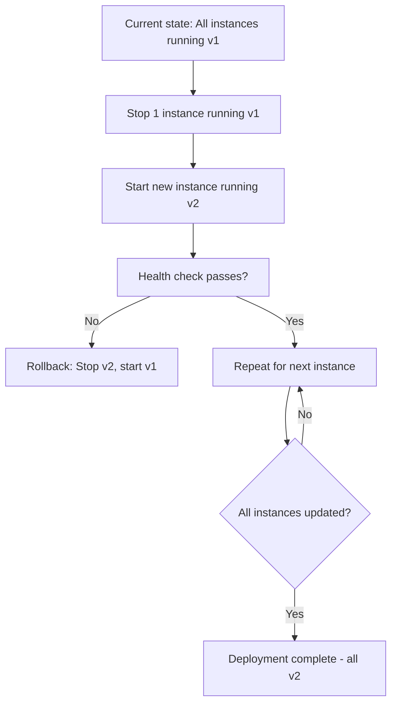
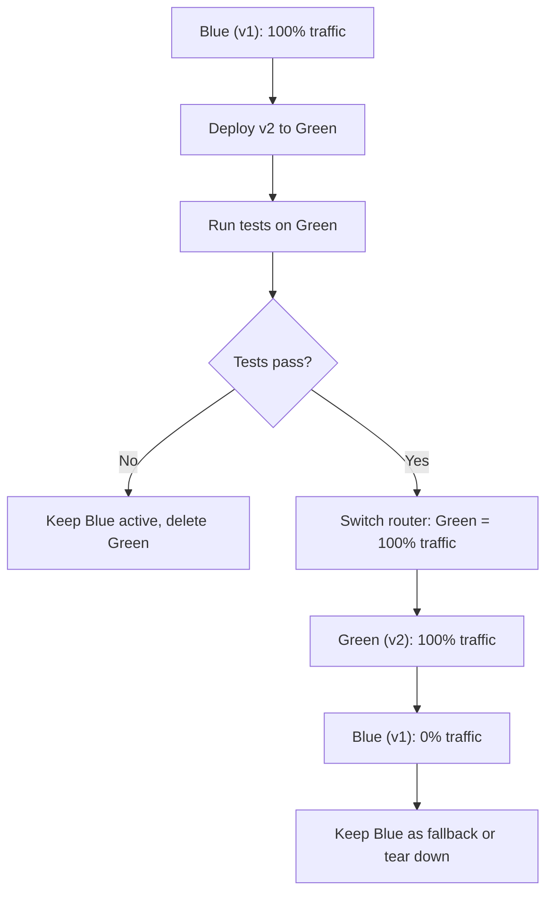
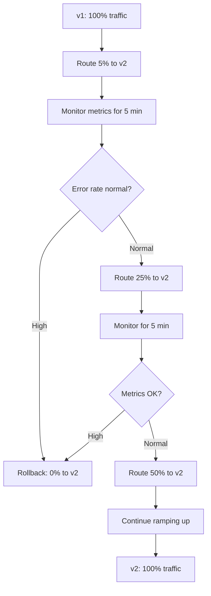

# Deployment Strategies

## Overview

**Deployment strategies** define how new application versions are rolled out to production while maintaining availability and minimizing risk.

Three common strategies:

* **Rolling Deployment** — gradually replace old instances with new ones
* **Blue-Green Deployment** — switch between two identical environments
* **Canary Deployment** — gradually shift traffic to new version

Each has different trade-offs for risk, speed, and resource usage.

---

## The Problem They Solve

Traditional deployments caused:

* application downtime during updates
* no rollback if issues appear
* inability to validate in production
* high-risk, high-stress deployment windows

Modern strategies maintain **consistent availability** while safely introducing new versions.

---

## Rolling Deployment

### How It Works

Gradually replace old instances with new ones, a few at a time.



### Characteristics

* **zero downtime** — always some instances running
* **immediate rollout** — all traffic goes to new version
* **gradual validation** — issues appear as more instances update
* **no redundancy needed** — uses existing capacity

### Example: Kubernetes Rolling Deployment

```yaml
apiVersion: apps/v1
kind: Deployment
metadata:
  name: myapp
spec:
  replicas: 4
  strategy:
    type: RollingUpdate
    rollingUpdate:
      maxSurge: 1           # 1 extra pod during update
      maxUnavailable: 1     # 1 pod can be unavailable
  template:
    spec:
      containers:
      - name: app
        image: myapp:2.0.0  # New version
```

### Jenkins Implementation

```groovy
stage('Deploy Rolling') {
    steps {
        sh '''
            INSTANCES=$(aws ec2 describe-instances --query "Reservations[0].Instances[*].InstanceId" --output text)
            for instance in $INSTANCES; do
                echo "Deploying to $instance"
                aws ssm send-command --instance-ids $instance --document-name "DeployNewVersion"
                sleep 30  # Wait for health check
                aws elb set-instance-health --load-balancer-name prod-lb --instances $instance --state InService
            done
        '''
    }
}
```

### Pros & Cons

| Pros | Cons |
| --- | --- |
| **Zero downtime** | Issues hit all traffic immediately |
| **Simple** | No extra infrastructure needed |
| **Fast** | Takes time (one pod at a time) |
| **Resource efficient** | Must maintain minimal version compatibility |

---

## Blue-Green Deployment

### How It Works

Maintain two identical production environments. Switch traffic between them.



### Characteristics

* **instant switchover** — all traffic moves at once
* **easy rollback** — switch back to blue immediately
* **requires redundancy** — need 2x infrastructure
* **full validation before switch** — test entire environment

### Jenkins Implementation

```groovy
stage('Deploy Blue-Green') {
    steps {
        sh '''
            # Deploy to Green environment
            ./deploy-to-green.sh
            
            # Run comprehensive tests
            ./test-green.sh
            
            if [ $? -eq 0 ]; then
                # Switch traffic
                ./switch-load-balancer.sh from-blue to-green
                echo "Switched to Green (v2)"
            else
                # Destroy Green
                ./teardown-green.sh
                exit 1
            fi
        '''
    }
}
```

### Pros & Cons

| Pros | Cons |
| --- | --- |
| **Instant rollback** | Requires 2x infrastructure cost |
| **Full pre-test** | Not suitable for DB schema changes |
| **No partial rollout** | Higher hosting costs during deploy |
| **Clear A/B testing** | More complex orchestration |

---

## Canary Deployment

### How It Works

Route a small percentage of traffic to new version, gradually increase.



### Characteristics

* **gradual traffic shift** — 5% → 25% → 50% → 100%
* **real-world validation** — see issues before full rollout
* **automatic rollback** — if error rate spikes, revert traffic
* **minimal risk** — issues affect small percentage
* **requires load balancer** — must split traffic programmatically

### Jenkins Implementation

```groovy
stage('Canary Deploy') {
    steps {
        sh '''
            CANARY_WEIGHTS="5 25 50 100"
            
            for weight in $CANARY_WEIGHTS; do
                echo "Setting canary traffic to $weight%"
                ./set-traffic-weight.sh $weight
                
                sleep 300  # Monitor
                
                ERROR_RATE=$(./get-error-rate.sh)
                if [ $ERROR_RATE -gt 0.05 ]; then
                    echo "High error rate detected, rolling back"
                    ./rollback-canary.sh
                    exit 1
                fi
            done
            
            echo "Canary deployment successful"
        '''
    }
}
```

### Pros & Cons

| Pros | Cons |
| --- | --- |
| **Lowest risk** | Slowest rollout (30-60 min) |
| **Real-world validation** | Requires sophisticated load balancer |
| **Automatic rollback** | Temporary 5% traffic to old version |
| **Small blast radius** | Complex to implement correctly |

---

## Strategy Comparison

| Feature | Rolling | Blue-Green | Canary |
| --- | --- | --- | --- |
| **Downtime** | Zero | Zero | Zero |
| **Rollback speed** | Slow (reverse rolling) | Instant (1s) | Fast (reroute traffic) |
| **Infrastructure** | 1x | 2x | 1x |
| **Risk** | Medium | Low | Very low |
| **Complexity** | Low | Medium | High |
| **Deployment time** | Medium (30 min) | Fast (5 min) | Slow (60 min) |
| **Testing environment** | Existing prod | Separate Green | 5% of prod |
| **Database changes** | Backward compatible | Easy (separate DBs) | Difficult (shared DB) |
| **Best for** | Startups | Critical apps | High-risk changes |

---

## Choosing a Strategy

### Use Rolling If:

* infrastructure is limited
* application can handle multiple versions
* gradual rollout is acceptable
* low complexity preferred

### Use Blue-Green If:

* reliable rollback critical for business
* can afford 2x infrastructure
* database schema stable
* instant switch is preferred

### Use Canary If:

* risk must be minimized
* monitoring is sophisticated
* gradual validation needed
* can tolerate 60-minute deploy

---

## Best Practices

### 1. Always Have a Rollback Plan

Every strategy needs quick rollback capability.

### 2. Monitor Deployment Metrics

```
Error rate
Response time
CPU/Memory usage
Database connections
```

### 3. Use Health Checks

```groovy
stage('Health Check') {
    steps {
        sh '''
            curl -f http://localhost:8080/health || exit 1
        '''
    }
}
```

### 4. Automate Everything

Manual deployments introduce human error.

### 5. Test Rollback Procedure

Verify rollback works before production deployment.

---

## Summary

* **Rolling deployment** gradually replaces instances; simplest, uses existing infrastructure

* **Blue-green deployment** maintains two environments; enables instant rollback

* **Canary deployment** shifts traffic gradually; lowest risk but slowest

* Choose based on risk tolerance, infrastructure, and business requirements

---
