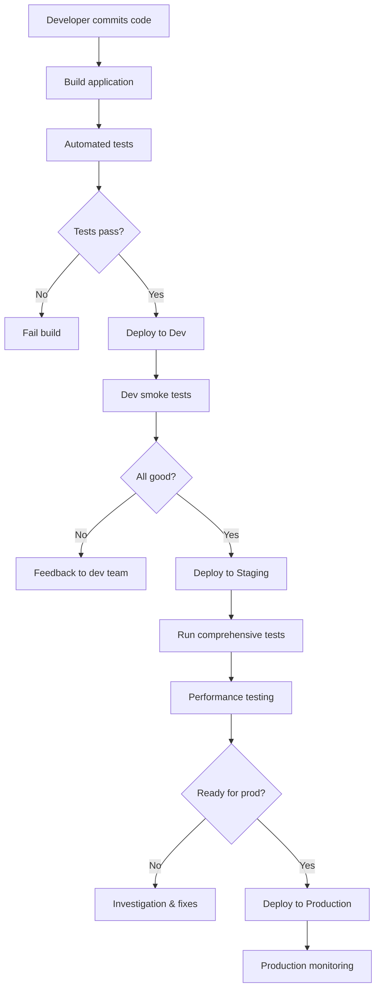

# Environment Strategy (Dev → Staging → Prod)

## Overview

**Environment Strategy** defines how applications progress from development through multiple environments before reaching production.

A typical pipeline includes:

* **Development (Dev)** — developers build and test features
* **Staging** — production-like environment for final validation
* **Production (Prod)** — live environment serving end users

Each environment serves a specific purpose and has different validation rigor.

---

## The Problem It Solves

Without structured environments:

* bugs reach users immediately
* environment differences cause failures ("works on my machine")
* difficult to test in realistic conditions
* no rollback capability if production fails
* developers deploy directly to production

Structured environments create **gates that catch issues early** before users are affected.

---

## How Environments Work

### Multi-Environment Pipeline Flow



---

## Development Environment

### Purpose

For developers to **build, test, and experiment** with code.

### Characteristics

* fast feedback loops
* frequent deployments (multiple times per day)
* less stable (intentional)
* mock external services
* limited integration testing

### Deployment Strategy

```groovy
stage('Deploy to Dev') {
    when {
        branch 'develop'
    }
    steps {
        sh './deploy.sh dev'
        sh './smoke-tests-dev.sh'
    }
}
```

---

## Staging Environment

### Purpose

**Production-like environment** that mirrors production as closely as possible.

### Characteristics

* **mirrors production infrastructure** (same database, services, configurations)
* more strict testing
* limited traffic (QA and internal users)
* used for performance and load testing
* last gate before production

### Deployment Strategy

```groovy
stage('Deploy to Staging') {
    when {
        branch 'main'
    }
    steps {
        input 'Deploy to staging?'
        sh './deploy.sh staging'
        sh './comprehensive-tests-staging.sh'
        sh './performance-test-staging.sh'
        sh './security-scan-staging.sh'
    }
}
```

---

## Production Environment

### Purpose

**Live environment** serving real users with **maximum stability and performance**.

### Characteristics

* zero-downtime deployments required
* extensive monitoring and alerting
* automated rollback on failure
* strict change control
* manual approval gates
* backup and disaster recovery ready

### Deployment Strategy

```groovy
stage('Deploy to Production') {
    input {
        message 'Deploy to production (affecting real users)?'
        ok 'Deploy'
    }
    steps {
        sh './canary-deploy.sh production 5'  // 5% of traffic
        sleep(time: 300, unit: 'SECONDS')      // Monitor for 5 minutes
        sh './verify-health.sh production'
        sh './ramp-up-deploy.sh production'    // Gradually increase to 100%
        sh './post-deploy-tests.sh production'
    }
}
```

---

## Environment Comparison

| Aspect | Dev | Staging | Production |
| --- | --- | --- | --- |
| **Purpose** | Experimentation | Final validation | Live users |
| **Data** | Test/mock data | Production-like | Real user data |
| **Frequency** | Multiple/day | 1-2 per day | Controlled |
| **Testing** | Smoke tests | Comprehensive | Post-deploy only |
| **Downtime** | Acceptable | Minimize | Zero downtime |
| **Approval** | None | QA approval | Executive approval |
| **Monitoring** | Basic | Detailed | 24/7 critical |
| **Rollback** | Manual | Manual/script | Automated |

---

## Jenkins Multi-Environment Pipeline

```groovy
pipeline {
    agent any

    stages {
        stage('Build') {
            steps {
                sh 'npm install && npm run build'
            }
        }

        stage('Unit Tests') {
            steps {
                sh 'npm run test:unit'
            }
        }

        stage('Deploy to Dev') {
            when {
                branch 'develop'
            }
            steps {
                sh 'npm run deploy:dev'
                sh 'npm run test:smoke:dev'
            }
        }

        stage('Deploy to Staging') {
            when {
                branch 'main'
            }
            steps {
                input 'Deploy to staging?'
                sh 'npm run deploy:staging'
                sh 'npm run test:integration:staging'
                sh 'npm run test:performance:staging'
            }
        }

        stage('Approval for Production') {
            when {
                branch 'main'
            }
            steps {
                input 'Deploy to PRODUCTION?'
            }
        }

        stage('Deploy to Production') {
            when {
                branch 'main'
            }
            steps {
                sh 'npm run deploy:prod:canary'
                sleep(time: 5, unit: 'MINUTES')
                sh 'npm run verify:prod'
                sh 'npm run deploy:prod:full'
            }
        }

        stage('Post-Deploy') {
            when {
                branch 'main'
            }
            steps {
                sh 'npm run smoke-tests:prod'
            }
        }
    }
}
```

---

## Best Practices

### 1. Staging = Production-like

Staging must mirror production as closely as possible:

* same database version
* same number of servers
* same load balancer configuration
* same monitoring and alerting

### 2. Environment Parity

Avoid "works in dev, fails in staging/prod" by keeping environments consistent.

### 3. Progressive Deployment

Dev → Staging → Production with validation at each gate.

### 4. Automated Testing Per Environment

```
Dev: Smoke tests (5 min)
Staging: Full integration + performance (30 min)
Prod: Post-deploy verification (2 min)
```

### 5. Separate Credentials

Each environment has separate API keys, database credentials, certificates.

---

## Summary

* Development is for rapid iteration and experimentation

* Staging mirrors production for comprehensive validation

* Production serves real users with strict controls

* Each environment has different testing rigor and deployment frequency
---
