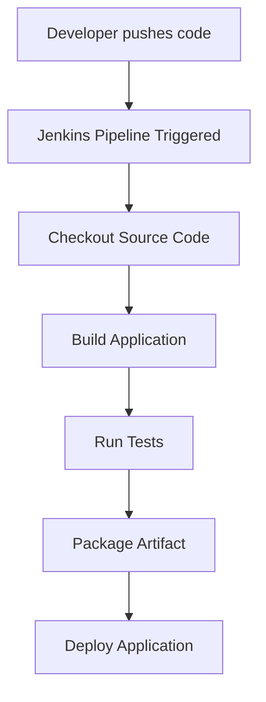

# How to Structure a Jenkins Pipeline

## Overview

A **Jenkins Pipeline** defines the automated steps required to build, test, and deploy an application.

Structuring a pipeline properly ensures that CI/CD workflows are:

* organized
* easy to maintain
* reproducible
* scalable

Jenkins pipelines are usually defined using a **Jenkinsfile** stored in the project repository.
The pipeline describes the **sequence of stages and steps** that Jenkins should execute.

---

## Core Structure of a Jenkins Pipeline

A typical Jenkins pipeline follows a structured hierarchy.

```
Pipeline
 ├── Agent
 ├── Environment (optional)
 ├── Stages
 │     ├── Stage
 │     │     └── Steps
 │     ├── Stage
 │     │     └── Steps
 │     └── Stage
 │           └── Steps
 └── Post Actions
```

Each component defines a specific part of the CI/CD workflow.

---

## Basic Pipeline Execution Flow

When a Jenkins pipeline runs, the following sequence typically occurs:



This structured flow ensures that the software passes through **multiple quality checks before deployment**.

---

## Main Components of a Jenkins Pipeline

### 1. Pipeline Block

The **pipeline block** is the root of the Jenkinsfile.

It defines the entire CI/CD workflow.

Example:

```groovy
pipeline {
    agent any
    stages {
        stage('Build') {
            steps {
                echo 'Building application'
            }
        }
    }
}
```

All pipeline configurations exist inside this block.

---

### 2. Agent

The **agent** specifies where the pipeline or stage should run.

Examples:

| Agent Type | Description                     |
| ---------- | ------------------------------- |
| `any`      | Run on any available agent      |
| `label`    | Run on a specific labeled agent |
| `docker`   | Run inside a Docker container   |
| `none`     | No global agent                 |

Example:

```groovy
agent any
```

This tells Jenkins to run the pipeline on any available executor.

---

### 3. Stages

**Stages** divide the pipeline into logical phases.

Each stage represents a major step in the CI/CD process.

Typical stages:

```
Checkout → Build → Test → Package → Deploy
```

Example:

```groovy
stages {
    stage('Build') {
        steps {
            echo 'Building project'
        }
    }

    stage('Test') {
        steps {
            echo 'Running tests'
        }
    }
}
```

Stages make pipelines **readable and easy to debug**.

---

### 4. Steps

Steps define the **actual commands executed in a stage**.

Examples include:

* running shell commands
* executing scripts
* calling build tools
* interacting with external services

Example:

```groovy
steps {
    sh 'npm install'
    sh 'npm test'
}
```

Each step performs a specific task.

---

### 5. Environment Variables

Environment variables allow pipelines to define configuration values.

Example:

```groovy
environment {
    APP_ENV = 'production'
}
```

These variables can be used throughout the pipeline.

Example usage:

```groovy
sh "echo Running in ${APP_ENV}"
```

---

### 6. Post Actions

The **post block** defines actions that occur after pipeline execution.

Examples:

* notifications
* cleanup
* artifact archiving

Example:

```groovy
post {
    always {
        echo 'Pipeline finished'
    }

    success {
        echo 'Build succeeded'
    }

    failure {
        echo 'Build failed'
    }
}
```

Post actions help handle **success and failure scenarios**.

---

## Example Jenkins Pipeline Structure

Example Jenkinsfile for a typical web application:

```groovy
pipeline {

    agent any

    stages {

        stage('Checkout') {
            steps {
                git 'https://github.com/example/project.git'
            }
        }

        stage('Install Dependencies') {
            steps {
                sh 'npm install'
            }
        }

        stage('Build') {
            steps {
                sh 'npm run build'
            }
        }

        stage('Test') {
            steps {
                sh 'npm test'
            }
        }

        stage('Deploy') {
            steps {
                sh './deploy.sh'
            }
        }

    }

}
```

This pipeline automates the **complete build lifecycle**.

---

## Recommended Pipeline Stage Order

Most CI/CD pipelines follow a consistent stage order.

| Stage    | Purpose                    |
| -------- | -------------------------- |
| Checkout | Pull code from repository  |
| Build    | Compile application        |
| Test     | Execute automated tests    |
| Package  | Create deployable artifact |
| Deploy   | Deploy application         |

This sequence ensures **code quality before deployment**.

---

## Best Practices for Structuring Pipelines

### 1. Keep Pipelines Modular

Break pipelines into clear stages:

```
Checkout → Build → Test → Deploy
```

This improves readability and debugging.

---

### 2. Use Parallel Stages Where Possible

Parallel execution reduces pipeline runtime.

Example:

```
Unit Tests
Integration Tests
Security Scans
```

---

### 3. Avoid Large Monolithic Pipelines

Large pipelines become difficult to maintain.

Instead, keep stages **focused and modular**.

---

### 4. Store Jenkinsfile in Version Control

Pipeline definitions should always be stored in Git.

This allows:

* version tracking
* collaboration
* rollback of pipeline changes

---

## Summary

* Jenkins pipelines define **automated CI/CD workflows**

* Pipelines are written in a **Jenkinsfile**

* A pipeline consists of **agents, stages, and steps**

* Stages divide the workflow into logical phases

* Steps execute the actual build and test commands

* Proper pipeline structure improves **readability, scalability, and maintainability**

---
