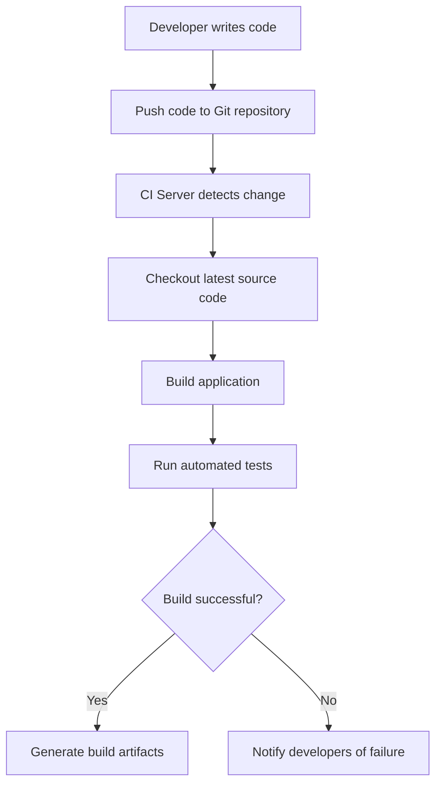

# What is Continuous Integration (CI)

## Overview

**Continuous Integration (CI)** is a software development practice where developers frequently integrate their code changes into a shared repository.

Every code change automatically triggers a process that:

* builds the application
* runs automated tests
* verifies the code

The goal of CI is to **detect integration issues early and maintain a stable codebase**.

CI is typically implemented using automation tools such as:

* Jenkins
* GitHub Actions
* GitLab CI
* CircleCI

---

## The Problem CI Solves

In traditional development workflows, developers worked on separate branches for long periods and merged changes infrequently.

This often led to problems such as:

* **integration conflicts**
* **broken builds**
* **difficult debugging**
* **delayed feedback**

This situation was commonly known as **“integration hell.”**

Continuous Integration solves this problem by encouraging **small, frequent code integrations** and automatic validation.

---

## How Continuous Integration Works

In a CI workflow, every change pushed to the repository triggers an automated pipeline.



This ensures that every commit is **validated automatically**.

---

## Core Principles of Continuous Integration

## 1. Frequent Code Integration

Developers should integrate their code frequently, ideally **multiple times per day**.

This reduces the complexity of merging large changes later.

---

## 2. Automated Builds

Every code change should automatically trigger a build process.

This ensures the application always remains in a **buildable state**.

---

## 3. Automated Testing

CI pipelines run automated tests to verify that new changes do not break existing functionality.

Common tests include:

* unit tests
* integration tests
* static code analysis

---

## 4. Fast Feedback

Developers should receive feedback quickly when a build fails.

This allows them to fix issues immediately.

---

## CI Pipeline Example

Example Jenkins pipeline:

```groovy
pipeline {
    agent any

    stages {
        stage('Checkout') {
            steps {
                git 'https://github.com/example/project.git'
            }
        }

        stage('Build') {
            steps {
                sh 'mvn compile'
            }
        }

        stage('Test') {
            steps {
                sh 'mvn test'
            }
        }
    }
}
```

This pipeline automatically builds and tests the application after each commit.

---

## Benefits of Continuous Integration

| Benefit                  | Explanation                                 |
| ------------------------ | ------------------------------------------- |
| Early Bug Detection      | Integration issues are discovered quickly   |
| Improved Code Quality    | Automated tests ensure stable code          |
| Faster Development       | Developers receive immediate feedback       |
| Reduced Integration Risk | Frequent merges reduce conflicts            |
| Reliable Builds          | Automated processes eliminate manual errors |

---

## Continuous Integration vs Traditional Development

| Traditional Workflow | Continuous Integration |
| -------------------- | ---------------------- |
| Infrequent merges    | Frequent integrations  |
| Manual builds        | Automated builds       |
| Late bug detection   | Early issue detection  |
| Risky releases       | Stable codebase        |

---

## CI vs Continuous Delivery vs Continuous Deployment

CI is often confused with other DevOps practices.

| Concept                | Description                                   |
| ---------------------- | --------------------------------------------- |
| Continuous Integration | Automatically build and test code changes     |
| Continuous Delivery    | Ensure builds are always ready for deployment |
| Continuous Deployment  | Automatically deploy changes to production    |

CI focuses primarily on **build and test automation**.

---

## Best Practices for Continuous Integration

### Commit Small Changes

Smaller commits reduce the risk of integration conflicts.

---

### Maintain a Fast Pipeline

CI pipelines should run quickly to provide fast feedback.

---

### Keep the Build Green

If the build fails, it should be fixed immediately.

---

### Use Automated Tests

Reliable automated tests are essential for CI.

---

## Interview Questions

### 1. What is Continuous Integration?

**Answer:**

Continuous Integration is a development practice where code changes are frequently integrated into a shared repository and automatically built and tested.

---

### 2. Why is Continuous Integration important?

**Answer:**

It helps detect integration issues early, improves code quality, and ensures the codebase remains stable.

---

### 3. What tools support Continuous Integration?

**Answer:**

Common CI tools include Jenkins, GitHub Actions, GitLab CI, and CircleCI.

---

### 4. What happens when a CI build fails?

**Answer:**

The CI system reports the failure and developers must fix the issue before further integrations.

---

### 5. How often should developers integrate code in CI?

**Answer:**

Developers should integrate code frequently, ideally several times per day.

---

## Summary

* **Continuous Integration (CI)** automates the process of building and testing code changes

* Every code commit triggers a **CI pipeline**

* CI helps detect bugs early and maintain a stable codebase

* Automated builds and tests improve development speed and reliability

* CI is a core practice in modern **DevOps workflows**

---
