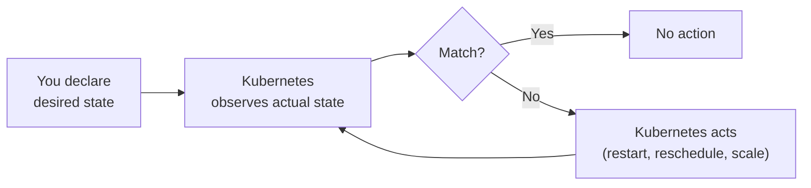
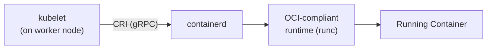

# Why Kubernetes? The Need for Orchestration

## Overview

Containers solved one critical problem — packaging and running applications consistently across environments.

But packaging is only the beginning.

In real production systems, questions like *"how do I keep this running reliably?"*, *"how do I scale when traffic spikes?"*, and *"how do I update this without taking the service down?"* — these are entirely separate problems that containers alone don't answer.

**Kubernetes** exists to answer those questions. It is the layer that sits above containers and takes care of running them at scale, reliably, and continuously.

---

## The Gap Containers Leave Behind

A single Docker container running on a single machine is easy to manage.

The moment a system grows beyond that, problems compound quickly:

### 1. Reliability

- Containers can crash. Processes fail. Machines go down.

- Without something watching over them, a crashed container stays crashed. Someone has to notice the failure, SSH into the machine, and restart it manually. In production, that is not acceptable.

### 2. Scale

- A single container instance can only handle so much traffic.

- When load spikes — say, around a product launch or a scheduled job — the system needs more instances. When load drops, running unnecessary containers wastes resources.

- Manually spinning containers up and down based on traffic is impractical at any meaningful scale.

### 3. Deployment

- Releasing a new version of an application by taking the old container down and starting the new one causes **downtime**.

- A smarter strategy — swapping containers one at a time, checking health, rolling back if something breaks — requires significant scripting and coordination if done manually.

### 4. Networking

- Multiple containers across multiple machines need to find and talk to each other.

- Container IPs are dynamic — they change every time a container is recreated. Hardcoding IPs breaks the moment anything restarts.

- A system needs a stable way to discover and route to services regardless of where or how many instances are running.

### 5. Configuration and Secrets

- Applications need environment-specific configuration and sensitive credentials.

- Baking these into container images is a security risk. Managing them externally with manual scripts across many containers is fragile.

---

## What Kubernetes Provides

Kubernetes is a **platform that automates all of the above**, declaratively.

Instead of issuing commands like "start this container on that machine", you declare the **desired state** of the system.

```
"I want 3 replicas of this service running, always,
reachable at this address, with these environment variables."
```

Kubernetes continuously watches the cluster and takes whatever action is needed to make reality match that declaration.



This model is called **desired state management** or **reconciliation**.

---

## Kubernetes vs Traditional Container Management

Before Kubernetes became the standard, teams managed containers manually or with lighter tools. Understanding the difference clarifies exactly what Kubernetes adds.

### Traditional Container Management

Running containers without an orchestrator typically looked like:

- `docker run` commands scripted in shell or Makefiles
- containers started manually on specific machines via SSH
- load balancers configured manually or with static config files
- cron jobs or monitoring scripts to restart failed containers
- environment variables set per machine in ad-hoc ways

This worked for small systems with a handful of containers and a small team. But it scaled poorly.

| Concern              | Traditional Approach                          | With Kubernetes                                 |
| -------------------- | --------------------------------------------- | ----------------------------------------------- |
| Container restarts   | Manual or custom monitoring scripts           | Automatic — kubelet + controller loops          |
| Scaling              | SSH into machines, run more containers        | `kubectl scale` or Horizontal Pod Autoscaler    |
| Deployments          | Take down old, bring up new (downtime)        | Rolling updates, zero downtime, auto rollback   |
| Service discovery    | Hardcoded IPs or manual DNS updates           | Internal cluster DNS, stable Service endpoints  |
| Configuration        | Environment variables set per machine         | ConfigMaps and Secrets managed centrally        |
| Multi-machine spread | Manual placement decisions                    | Scheduler places pods based on resources        |
| Health monitoring    | External scripts or manual checks             | Liveness and readiness probes built in          |
| Storage              | Volumes mounted manually per host             | Persistent Volume Claims, dynamic provisioning  |

### The Core Shift

- Traditional management is **imperative** — you tell the system what to do, step by step.

- Kubernetes management is **declarative** — you tell the system what you want, and it figures out how to get there and how to stay there.

- This is the reason Kubernetes scales operationally even as the number of services and machines grows significantly.

---

## Docker Swarm — The Middle Ground

Before Kubernetes dominated, **Docker Swarm** was the main alternative for lightweight orchestration.

Swarm is built into the Docker CLI and is far simpler to set up. It handles basic scheduling, scaling, and service discovery.

But Swarm lacks the depth of Kubernetes — no advanced autoscaling, limited ecosystem, less granular control over scheduling, and far fewer integrations with cloud infrastructure.

For small internal tools or simple workloads, Swarm is still usable. For production-grade, multi-service backends, Kubernetes is the standard.

---

## The Role of containerd

Kubernetes does not run containers itself.

It delegates that responsibility to a **container runtime** — the software that actually creates and manages containers on the node.

### What containerd Is

**containerd** is an industry-standard, high-performance container runtime that manages the complete lifecycle of a container:

- pulling images from a registry
- unpacking and storing image layers
- creating and starting containers
- managing container I/O and networking hooks
- stopping and deleting containers

It was originally extracted from Docker and donated to the CNCF. It is now the **default container runtime** in most Kubernetes distributions.

### How Kubernetes Uses containerd

Kubernetes communicates with the container runtime through a standard interface called the **Container Runtime Interface (CRI)**.



- **kubelet** (the Kubernetes node agent) calls the CRI to create, start, stop, and inspect containers
- **containerd** receives those calls and does the actual work
- **runc** is the low-level OCI runtime that containerd uses to actually start the container process

### Why Not Docker?

Kubernetes originally used Docker as its container runtime, communicating through a compatibility layer called **dockershim**.

Docker was never designed as a pure runtime — it is a full developer toolchain (build, push, run, compose). This made it heavier than necessary for a production Kubernetes node.

In Kubernetes 1.24, **dockershim was removed**.

containerd was already running inside Docker — Docker itself used containerd under the hood. So the shift was a simplification: Kubernetes now talks directly to containerd via CRI, eliminating the unnecessary middle layer.

Docker is still used to **build images** — it's just no longer used as the runtime on Kubernetes nodes.

### Other Supported Runtimes

| Runtime        | Description                                                             |
| -------------- | ----------------------------------------------------------------------- |
| **containerd** | Default runtime — lightweight, fast, CRI-native                        |
| **CRI-O**      | Minimal runtime purpose-built for Kubernetes, OCI-compliant            |
| **Docker**     | No longer supported as a Kubernetes runtime (removed in K8s 1.24)      |

---

## Interview Questions

### 1. Why isn't Docker alone sufficient for production systems?

**Answer:**
Docker handles packaging and running containers but provides no built-in solution for scaling, self-healing, rolling deployments, or multi-machine orchestration. Kubernetes fills that gap.

---

### 2. What is the difference between imperative and declarative container management?

**Answer:**
Imperative means issuing direct commands ("start this container"). Declarative means stating the desired state ("3 replicas of this service"), and letting the system figure out how to achieve and maintain it — which is how Kubernetes works.

---

### 3. What is containerd and why does Kubernetes use it?

**Answer:**
containerd is a CRI-compliant container runtime that manages the full lifecycle of containers on a node. Kubernetes delegates actual container execution to containerd via the Container Runtime Interface (CRI).

---

### 4. Why was dockershim removed from Kubernetes?

**Answer:**
Docker was never a pure runtime — it's a developer toolchain. Kubernetes removed the dockershim compatibility layer in v1.24 and switched to talking directly to containerd via CRI, which is simpler and more performant.

---

### 5. What is the Container Runtime Interface (CRI)?

**Answer:**
CRI is a gRPC API that defines how kubelet communicates with a container runtime. Any runtime that implements CRI (like containerd or CRI-O) can be used with Kubernetes.

---

## Summary

- Containers solve packaging, but not reliability, scaling, deployment, or networking at scale

- Kubernetes fills that gap by automating all operational concerns through a declarative, desired-state model

- Traditional container management is manual and imperative — Kubernetes replaces it with a self-correcting, reconciliation-driven system

- containerd is the default container runtime in Kubernetes — it handles the actual creation and lifecycle of containers on each node

- Kubernetes communicates with containerd through the **Container Runtime Interface (CRI)**, and containerd uses **runc** to start container processes

---
