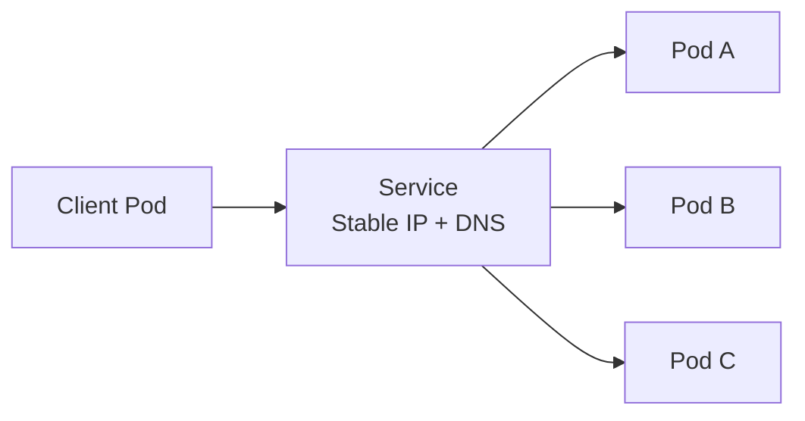

# Services

## Overview

A **Service** in Kubernetes provides a stable network identity for a group of Pods.

Pods are ephemeral:

- Pod IPs can change when Pods restart or are replaced
- Pod count can change during scaling
- Pods may move across nodes

A Service solves this by offering:

- a stable virtual IP (ClusterIP)
- a stable DNS name
- load balancing across matching Pods

Without Services, clients would need to track changing Pod IPs manually.

---

## Why Services Are Needed

A Deployment can keep Pods running, but Pod endpoints are not stable.

Example problem:

1. frontend Pod calls backend Pod at `10.244.1.9`
2. backend Pod crashes and is replaced
3. new backend Pod gets `10.244.2.17`
4. frontend still calls old IP and fails

A Service fixes this by exposing a fixed endpoint (for example, `backend-service`) that always routes to healthy backend Pods.

---

## How a Service Works

A Service uses **labels and selectors** to find target Pods called **endpoints**.



Internally:

- the Service controller watches Pods matching selectors
- endpoint objects are updated as Pods come and go
- kube-proxy (or eBPF data plane) handles routing and load balancing

---

## Basic Service Manifest

```yaml
apiVersion: v1
kind: Service
metadata:
  name: backend-service
spec:
  selector:
    app: backend-api
  ports:
    - protocol: TCP
      port: 80
      targetPort: 8080
```

### Key Fields

| Field | Purpose |
|---|---|
| `spec.selector` | Chooses Pods with matching labels |
| `ports.port` | Port exposed by the Service |
| `ports.targetPort` | Port on Pod containers to forward traffic to |
| `ports.protocol` | Network protocol, usually `TCP` |
| `spec.type` | Service type (`ClusterIP`, `NodePort`, `LoadBalancer`) |

---

## Service Type 1: ClusterIP

`ClusterIP` is the default Service type.

It exposes the Service only **inside the cluster**.

Use cases:

- internal microservice-to-microservice communication
- backend APIs only consumed by in-cluster clients
- database access from app Pods

### Example

```yaml
apiVersion: v1
kind: Service
metadata:
  name: backend-clusterip
spec:
  type: ClusterIP
  selector:
    app: backend-api
  ports:
    - port: 80
      targetPort: 8080
```

How to access:

- from another Pod: `http://backend-clusterip:80`
- via DNS: `backend-clusterip.<namespace>.svc.cluster.local`

### ClusterIP Characteristics

- reachable only from inside cluster network
- stable virtual IP and DNS
- no direct external access

---

## Service Type 2: NodePort

`NodePort` exposes the Service on a static port on every node.

When created:

- Kubernetes allocates a port from range `30000-32767` (or you can set one)
- traffic to `<NodeIP>:<NodePort>` routes to matching Pods

Use cases:

- quick testing from outside cluster
- simple non-production exposure
- bare metal environments without cloud load balancer

### Example

```yaml
apiVersion: v1
kind: Service
metadata:
  name: backend-nodeport
spec:
  type: NodePort
  selector:
    app: backend-api
  ports:
    - port: 80
      targetPort: 8080
      nodePort: 30080
```

Access from outside:

- `http://<node-ip>:30080`

### NodePort Characteristics

- externally reachable through node IPs
- opens same port on all worker nodes
- less secure and less flexible for production internet traffic

---

## Service Type 3: LoadBalancer

`LoadBalancer` integrates with cloud provider load balancers.

When created (in cloud-managed clusters):

- cloud load balancer is provisioned
- external IP or hostname is assigned
- traffic is forwarded to Service, then to Pods

Use cases:

- exposing production APIs to internet
- public app entry point in cloud environments
- integrating with cloud-native networking

### Example

```yaml
apiVersion: v1
kind: Service
metadata:
  name: backend-lb
spec:
  type: LoadBalancer
  selector:
    app: backend-api
  ports:
    - port: 80
      targetPort: 8080
```

Check external endpoint:

```bash
kubectl get svc backend-lb
```

### LoadBalancer Characteristics

- easiest cloud-native external exposure
- generally creates a NodePort behind the scenes
- may incur cloud cost
- not available by default in local clusters unless using addons (for example MetalLB)

---

## ClusterIP vs NodePort vs LoadBalancer

| Type | Scope | External Access | Common Use |
|---|---|---|---|
| `ClusterIP` | Internal cluster | No | Service-to-service communication |
| `NodePort` | Node network | Yes (`NodeIP:NodePort`) | Testing and basic exposure |
| `LoadBalancer` | Cloud external LB | Yes (public/private LB IP) | Production external endpoints |

Rule of thumb:

- use `ClusterIP` for internal traffic
- use `LoadBalancer` for external production traffic
- use `NodePort` mainly for labs/testing or specific infra needs

---

## Service Discovery and DNS

Each Service gets a DNS entry from CoreDNS.

Common name formats:

- same namespace: `backend-service`
- cross namespace: `backend-service.dev`
- full FQDN: `backend-service.dev.svc.cluster.local`

This lets applications call each other by name instead of hardcoded IPs.

---

## Ports Clarified

A common confusion is the difference between `port`, `targetPort`, and `nodePort`.

- `port`: Service port that clients connect to
- `targetPort`: container port in Pods
- `nodePort`: external node-level port (only for NodePort/LoadBalancer)

Example mapping:

- client calls Service on `80` (`port`)
- Service forwards to Pod on `8080` (`targetPort`)
- external client may call node on `30080` (`nodePort`)

---

## Headless Services (Important Mention)

If you set `clusterIP: None`, Kubernetes creates a **headless Service**.

- no virtual IP is allocated
- DNS returns Pod IPs directly
- useful for StatefulSets and direct Pod addressing

Example:

```yaml
apiVersion: v1
kind: Service
metadata:
  name: db-headless
spec:
  clusterIP: None
  selector:
    app: db
  ports:
    - port: 5432
      targetPort: 5432
```

---

## Useful Service Commands

```bash
# List services
kubectl get svc

# Describe a service
kubectl describe svc backend-service

# Get service as YAML
kubectl get svc backend-service -o yaml

# Check endpoints selected by service
kubectl get endpoints backend-service

# Create/update from file
kubectl apply -f service.yaml

# Delete service
kubectl delete svc backend-service
```

---

## Common Issues and Troubleshooting

### 1. Service has no endpoints

Symptom:

- Service exists, but requests fail/time out

Cause:

- selector labels do not match Pod labels

Check:

```bash
kubectl get svc backend-service -o yaml
kubectl get pods --show-labels
kubectl get endpoints backend-service
```

Fix:

- align Service selector with Pod template labels

### 2. NodePort not reachable from outside

Possible causes:

- wrong node IP used
- firewall/security group blocks nodePort range
- worker node not accessible

Check node and network policies/security rules.

### 3. LoadBalancer EXTERNAL-IP pending

Possible causes:

- running on local cluster without LB integration
- cloud permissions/quota issues
- controller misconfiguration

Check cloud provider integration and events.

---

## Best Practices

- Use label conventions consistently (`app`, `tier`, `env`, `version`).
- Prefer `ClusterIP` for internal communication.
- Use Ingress or Gateway API for HTTP routing at scale instead of many LoadBalancer services.
- Avoid hardcoded Pod IPs in application code.
- Combine Services with readiness probes so only ready Pods receive traffic.
- Use NetworkPolicies to control who can talk to what.

---

## Interview Questions

### 1. Why do we need Services if Deployments already manage Pods?

**Answer:**
Deployments manage Pod lifecycle and replica count, but Pod IPs are ephemeral. Services provide a stable endpoint and load balancing across changing Pods.

---

### 2. What is the difference between ClusterIP, NodePort, and LoadBalancer?

**Answer:**
ClusterIP exposes service only inside cluster. NodePort exposes it on `<NodeIP>:<NodePort>`. LoadBalancer provisions a cloud load balancer with an external endpoint.

---

### 3. What happens if Service selectors do not match Pod labels?

**Answer:**
The Service will have no endpoints, so traffic cannot be forwarded to any Pod.

---

### 4. Explain `port`, `targetPort`, and `nodePort`.

**Answer:**
`port` is the Service-facing port, `targetPort` is Pod container port, and `nodePort` is node-level external port used by NodePort/LoadBalancer types.

---

## Summary

* Services give Kubernetes workloads a stable network identity and built-in load balancing

* `ClusterIP` is default and used for internal service communication

* `NodePort` exposes services on node IP and high port range

* `LoadBalancer` provides cloud-native external access for production endpoints

* Correct labels/selectors and endpoint validation are essential for reliable traffic flow

Mastering Services is a core step before learning Ingress, Gateway API, and advanced traffic management.

---