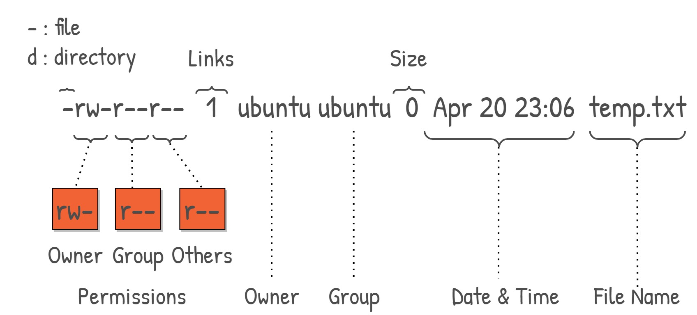

# Linux File and Directory Properties

## Overview

In Linux, every file and directory carries **metadata** that defines:

* ownership with user and group

* permissions for read, write, and execute

* size in bytes

* timestamps for access, modification, and metadata changes

* type (regular file, directory, symbolic link, etc.)

* inode information that links to the file's data on disk


---

## Viewing File Properties

The primary command to inspect file properties:

```bash
ls -l
```

Example output:

```bash
-rwxr-xr-- 1 ben developers 4096 Jan 15 10:30 app.sh
```

To see detailed metadata:

```bash
stat app.sh
```

---

## Structure of `ls -l` Output



Let’s break this down.

---

## 1️⃣ File Type

The first character indicates file type:

| Symbol | Type             |
| ------ | ---------------- |
| `-`    | Regular file     |
| `d`    | Directory        |
| `l`    | Symbolic link    |
| `c`    | Character device |
| `b`    | Block device     |
| `s`    | Socket           |
| `p`    | Named pipe       |

Example:

```
drwxr-xr-x 2 ben ben 4096 Jan 10 folder/
```

`d` → directory

---

## 2️⃣ File Permissions

Permissions follow this structure:

```
rwxr-xr--
```

Divided into three groups:

```
Owner | Group | Others
rwx   r-x     r--
```

| Symbol | Meaning |
| ------ | ------- |
| r      | read    |
| w      | write   |
| x      | execute |

---

### Permission Example

```
-rwxr-xr--
```

* Owner → read, write, execute
* Group → read, execute
* Others → read only

---

### Numeric (Octal) Permissions

Each permission has a numeric value:

| Permission | Value |
| ---------- | ----- |
| r          | 4     |
| w          | 2     |
| x          | 1     |

Example:

```
rwxr-xr-- = 754
```

Change permissions:

```bash
chmod 754 file.sh
```

---

## 3️⃣ Ownership

Each file has:

* a **user owner**
* a **group owner**

Example:

```
ben developers
```

Change owner:

```bash
chown user:group file.txt
```

Example:

```bash
sudo chown root:root app.sh
```

---

## 4️⃣ File Size

Displayed in bytes.

Use human-readable format:

```bash
ls -lh
```

Example:

```
4.0K app.sh
```

---

## 5️⃣ Timestamps

Linux tracks three main timestamps:

| Timestamp | Meaning                |
| --------- | ---------------------- |
| atime     | Last access time       |
| mtime     | Last modification time |
| ctime     | Last metadata change   |

View with:

```bash
stat file.txt
```

These timestamps are crucial in:

* log analysis
* debugging deployments
* forensics

---

## 6️⃣ Inode

Every file in Linux has an **inode number**.

An inode stores:

* file permissions
* owner
* timestamps
* disk block locations

But NOT the filename.

View inode:

```bash
ls -i file.txt
```

Example:

```
123456 file.txt
```

Multiple filenames can point to the same inode (hard links).

---

## 7️⃣ Directory Properties

Directories also have permissions.

For directories:

| Permission | Meaning                  |
| ---------- | ------------------------ |
| r          | list contents            |
| w          | create/delete files      |
| x          | enter/traverse directory |

Example:

```
drwxr-x---
```

If `x` is missing, you cannot enter the directory.

---

## Special Permission Bits

Linux also supports advanced permissions:

### SUID (Set User ID)

Runs executable as file owner.

```bash
chmod u+s file
```

---

### SGID (Set Group ID)

Runs executable as group owner.

---

### Sticky Bit

Common in `/tmp`.

Prevents users from deleting files owned by others.

Example:

```
drwxrwxrwt
```

`t` indicates sticky bit.

---

## Interview Questions

### 1. What information does `ls -l` provide?

**Answer:**
File type, permissions, number of links, owner, group, size, and last modified time.

---

### 2. What is an inode?

**Answer:**
An inode stores file metadata and disk block locations but not the filename.

---

### 3. What does `chmod 755` mean?

**Answer:**
Owner has full permissions (7), group and others have read and execute (5).

---

### 4. Difference between mtime and ctime?

**Answer:**
mtime tracks content modification; ctime tracks metadata changes.

---

### 5. What does execute permission mean for directories?

**Answer:**
It allows traversal into the directory.

---

## Summary

* Every file has metadata: type, permissions, owner, size, timestamps, inode

* Permissions control security and access

* Directories interpret permissions differently from regular files

* Inodes store metadata, not filenames

* Most real-world Linux issues involve permission or ownership problems

---
